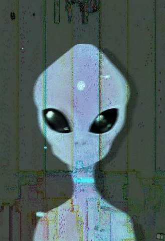

    <h2>👾 Hello World 👾</h2>
    
    
I'm Michele Federici, an hardcore tech-nerd who loves computer aesthetic, coding, (breaking) security and living the sweeet life 🍷

    <h3>About me</h3>
    
I ♥ open systems, rust, linux, bitcoin, and hacking around with all kinds of technologies.

    
I'm currently working as Head Blockchain Engineering at <a href="https://seba.swiss/" target="blank">SEBA Bank</a>

    
Besides the nerd stuff, I'm passionate about wine, nature, music and every other pleasure this planet can offer.

    <h3>Ask me about</h3>
    
👨🏼‍💻 Software Development, 🔒 Cyber Security, ⛓ Bitcoin and Blockchain Tech

    <h3>Connect with me (don't spam bs or my alien friend will kidnap you)</h3>
    <a href="https://telegram.me/ps1dr3x" target="blank">
        &nbsp; &nbsp;
    </a>
    <a href="https://www.linkedin.com/in/michelefederici/" target="blank">
        &nbsp; &nbsp;
    </a>
    <a href="https://github.com/ps1dr3x" target="blank">
        &nbsp; &nbsp;
    </a>
    <h3>Random swag</h3>
    &nbsp; &nbsp;
    

###### Alien gif CC [@instaphazed](https://linktr.ee/instaphazed)